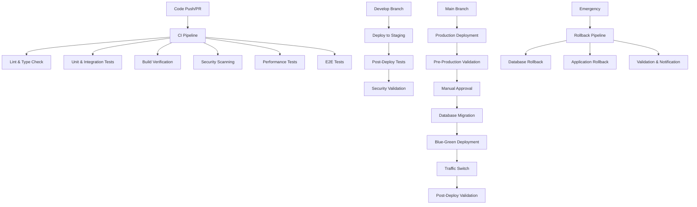

# GreenLink Capital CI/CD Pipeline Documentation

**Document ID**: P1-005  
**Status**: Completed  
**Last Updated**: 2024-01-15  
**Version**: 1.0.0

## 📋 Overview

Comprehensive CI/CD pipeline implementation for GreenLink Capital's multi-portal platform, featuring automated testing, security scanning, multi-environment deployment, and enterprise-grade operational procedures.

## 🏗️ Pipeline Architecture

### CI/CD Workflow Structure



## 🔄 Continuous Integration (CI)

### CI Pipeline Triggers
- **Push Events**: `main`, `develop`, `feature/**`, `hotfix/**` branches
- **Pull Requests**: Against `main` and `develop` branches
- **Manual Dispatch**: On-demand pipeline execution

### CI Pipeline Stages

#### 1. Code Quality & Linting
```yaml
Jobs:
  - lint-and-typecheck
    - ESLint validation across all packages
    - TypeScript compilation verification
    - Import/export consistency checks
    - Turborepo caching optimization
```

#### 2. Testing Matrix
```yaml
Jobs:
  - test (matrix: unit, integration, api-contract)
    - Jest unit tests with 80%+ coverage requirement
    - Integration tests with MSW mock services
    - API contract validation against OpenAPI spec
    - Codecov integration for coverage reporting
```

#### 3. Build Verification
```yaml
Jobs:
  - build (matrix: 5 applications)
    - investor-portal, issuer-portal, partner-portal
    - operator-portal, website
    - Next.js production builds
    - Bundle analysis and optimization
    - Build artifact generation
```

#### 4. Security Scanning
```yaml
Jobs:
  - security-scan
    - npm audit for dependency vulnerabilities
    - Snyk security analysis
    - CodeQL static analysis
    - TruffleHog secret scanning
    - License compliance validation
```

#### 5. Performance & Accessibility
```yaml
Jobs:
  - performance
    - Lighthouse CI audits
    - Bundle size analysis with size-limit
    - Core Web Vitals monitoring
  - accessibility
    - WCAG 2.1 AA compliance testing
    - axe-core accessibility validation
```

#### 6. End-to-End Testing
```yaml
Jobs:
  - e2e (matrix: chromium, firefox, webkit)
    - Playwright cross-browser testing
    - Critical user journey validation
    - Visual regression testing
    - Multi-portal integration tests
```

### CI Quality Gates
- ✅ All linting and type checking must pass
- ✅ Test coverage ≥80% for unit tests, ≥70% for integration
- ✅ Build success for all 5 applications
- ✅ No critical security vulnerabilities
- ✅ Performance score ≥80 (Lighthouse)
- ✅ Accessibility score ≥90 (WCAG 2.1 AA)

## 🚀 Continuous Deployment (CD)

### Staging Deployment (`develop` branch)

#### Pre-deployment Checks
```yaml
Validation:
  - CI status verification
  - Security vulnerability assessment
  - Critical system health checks
```

#### Database Migration
```yaml
Process:
  - Backup current staging database
  - Execute pending migrations
  - Verify database health and integrity
  - Rollback capability maintenance
```

#### Application Deployment
```yaml
Strategy: "Parallel deployment across 5 portals"
Applications:
  - investor-portal (investor-staging.greenlink.capital)
  - issuer-portal (issuer-staging.greenlink.capital)
  - partner-portal (partner-staging.greenlink.capital)
  - operator-portal (operator-staging.greenlink.capital)
  - website (www-staging.greenlink.capital)
```

#### Post-deployment Validation
```yaml
Tests:
  - Smoke tests across all portals
  - API contract validation
  - Critical user journey verification
  - Performance benchmarking
  - Security posture validation
```

### Production Deployment (`main` branch)

#### Pre-production Validation
```yaml
Checks:
  - Staging deployment success verification
  - Security and compliance validation
  - Performance metrics validation
  - License compliance verification
```

#### Manual Approval Process
```yaml
Environment: "production-approval"
Timeout: "24 hours"
Approvers: "Production deployment team"
Override: "Force deployment capability for emergencies"
```

#### Blue-Green Deployment Strategy

**Phase 1: Green Environment Deployment**
```yaml
Process:
  - Deploy all applications to green environment
  - Comprehensive testing in green environment
  - Performance and security validation
  - Readiness verification
```

**Phase 2: Traffic Switching**
```yaml
Canary Option:
  - 10% traffic to green environment
  - Monitor error rates and performance
  - Full traffic switch on validation
  
Full Deployment:
  - Immediate 100% traffic switch
  - DNS record updates
  - Load balancer configuration
```

**Phase 3: Blue Environment Cleanup**
```yaml
Process:
  - Scale down blue environment (keep for rollback)
  - Container image cleanup
  - Resource optimization
```

#### Post-deployment Validation
```yaml
Comprehensive Checks:
  - Health checks across all endpoints
  - Business metric validation
  - Security posture verification
  - Performance monitoring
  - User experience validation
```

## 🔒 Security Pipeline

### Daily Security Scans
```yaml
Schedule: "Daily at 2 AM UTC"
Scans:
  - dependency-scan: "Vulnerability assessment of all dependencies"
  - secret-scan: "Credential and secret detection"
  - code-analysis: "Static security analysis with CodeQL"
  - compliance-scan: "GDPR, license, and regulatory compliance"
  - container-scan: "Docker image security analysis"
```

### Security Scan Components

#### 1. Dependency Vulnerability Scanning
```yaml
Tools:
  - pnpm audit: "Built-in vulnerability detection"
  - Snyk: "Professional vulnerability database"
  - OSV-Scanner: "Google's Open Source Vulnerability scanner"
Thresholds:
  - Critical: "Block deployment"
  - High: "Require review"
  - Medium: "Monitor and plan fixes"
```

#### 2. Secret and Credential Scanning
```yaml
Tools:
  - TruffleHog: "Git history secret scanning"
  - GitLeaks: "Configuration-based secret detection"  
  - Custom patterns: "GreenLink-specific credential patterns"
Scope:
  - Full git history analysis
  - Environment file detection
  - Hardcoded credential identification
```

#### 3. Static Code Security Analysis
```yaml
Tools:
  - CodeQL: "GitHub's semantic analysis"
  - ESLint Security: "Security-focused linting rules"
  - Semgrep: "Pattern-based security analysis"
Focus Areas:
  - Authentication system security
  - JWT implementation validation
  - Input validation and sanitization
  - XSS and CSRF protection
```

#### 4. Compliance and License Scanning
```yaml
Checks:
  - License compliance: "GPL/AGPL detection and approval"
  - GDPR compliance: "Privacy-related code analysis"
  - Security headers: "Security configuration validation"
  - Regulatory requirements: "Financial services compliance"
```

## 🔄 Rollback System

### Automated Rollback Triggers
```yaml
Conditions:
  - Error rate > 2%  
  - Response time > 1000ms (P95)
  - Critical service failures
  - Security incident detection
```

### Manual Rollback Process
```yaml
Inputs:
  - environment: "staging | production"
  - rollback_version: "Target version (auto-detect if empty)"
  - reason: "Required justification"
  - include_database: "Database rollback flag (DANGEROUS)"
  - force_rollback: "Skip confirmation for emergencies"
```

### Rollback Validation
```yaml
Checks:
  - Target version existence verification
  - Breaking change analysis
  - Database migration assessment
  - Artifact availability confirmation
```

### Rollback Execution
```yaml
Process:
  1. Manual confirmation (unless forced)
  2. Database rollback (if requested)
     - Emergency backup creation
     - Restore from target version backup
     - Integrity verification
  3. Application rollback
     - Deploy previous version containers
     - Health check validation
     - Traffic verification
  4. Post-rollback validation
     - Comprehensive health checks
     - Functionality verification
     - Performance validation
```

## 📊 Monitoring and Alerting

### CI/CD Metrics
```yaml
Tracked Metrics:
  - Build success rate
  - Test coverage percentage
  - Deployment frequency
  - Lead time for changes
  - Mean time to recovery
  - Security vulnerability trends
```

### Notification System
```yaml
Channels:
  - Slack integration (#greenlink-dev, #greenlink-deployments, #greenlink-security)
  - GitHub status updates
  - Email notifications for critical issues
  - PagerDuty integration for production emergencies
```

### Alert Thresholds
```yaml
CI Alerts:
  - Build failure rate > 20%
  - Test coverage drop > 5%
  - Critical security vulnerabilities
  
CD Alerts:
  - Deployment failures
  - Post-deploy test failures
  - Performance degradation
  - Security posture changes
```

## 🛠️ Configuration and Setup

### Required Secrets
```yaml
GitHub Secrets:
  # Authentication
  - TURBO_TOKEN: "Turborepo cache token"
  - CODECOV_TOKEN: "Code coverage reporting"
  
  # Deployment
  - VERCEL_TOKEN: "Vercel deployment token"
  - VERCEL_ORG_ID: "Vercel organization ID"
  - VERCEL_PROJECT_ID: "Vercel project ID"
  - DOCKER_USERNAME: "Container registry username"
  - DOCKER_PASSWORD: "Container registry password"
  
  # Database
  - STAGING_DATABASE_URL: "Staging database connection"
  - PRODUCTION_DATABASE_URL: "Production database connection"
  - STAGING_REDIS_URL: "Staging Redis connection"
  - PRODUCTION_REDIS_URL: "Production Redis connection"
  
  # Security
  - SNYK_TOKEN: "Snyk security scanning"
  - GITLEAKS_LICENSE: "GitLeaks license key"
  - SEMGREP_APP_TOKEN: "Semgrep analysis token"
  
  # Authentication
  - STAGING_JWT_ACCESS_SECRET: "Staging JWT access secret"
  - STAGING_JWT_REFRESH_SECRET: "Staging JWT refresh secret"
  - PRODUCTION_JWT_ACCESS_SECRET: "Production JWT access secret"
  - PRODUCTION_JWT_REFRESH_SECRET: "Production JWT refresh secret"
  
  # External Services
  - AWS_ACCESS_KEY_ID: "AWS access for backups"
  - AWS_SECRET_ACCESS_KEY: "AWS secret for backups"
  - ROUTE53_ZONE_ID: "DNS management"
  
  # Notifications
  - SLACK_WEBHOOK_URL: "Slack notifications"
  - PAGERDUTY_WEBHOOK_URL: "Emergency alerting"
  - PAGERDUTY_INTEGRATION_KEY: "PagerDuty integration"
  
  # Testing
  - STAGING_TEST_USER_EMAIL: "Test user credentials"
  - STAGING_TEST_USER_PASSWORD: "Test user credentials"
  - PRODUCTION_TEST_USER_EMAIL: "Production test credentials"
  - PRODUCTION_TEST_USER_PASSWORD: "Production test credentials"
  - LHCI_GITHUB_APP_TOKEN: "Lighthouse CI integration"
```

### Environment Variables
```yaml
GitHub Variables:
  - TURBO_TEAM: "Turborepo team identifier"
  - NODE_VERSION: "18.19.0"
  - PNPM_VERSION: "9.0.0"
```

### Branch Protection Rules
```yaml
Main Branch:
  - Require pull request reviews (2 reviewers)
  - Require status checks to pass
  - Require branches to be up to date
  - Require signed commits
  - Include administrators
  
Develop Branch:
  - Require pull request reviews (1 reviewer)
  - Require status checks to pass
  - Allow force pushes for maintainers
```

## 🎯 Performance Metrics

### CI Pipeline Performance
```yaml
Target Metrics:
  - Total CI time: < 20 minutes
  - Lint & Type Check: < 5 minutes
  - Test Suite: < 10 minutes
  - Build Verification: < 15 minutes
  - Security Scan: < 10 minutes
  - E2E Tests: < 15 minutes
```

### Deployment Performance
```yaml
Target Metrics:
  - Staging deployment: < 10 minutes
  - Production deployment: < 30 minutes
  - Rollback time: < 5 minutes
  - Zero-downtime deployments: 100%
```

### Quality Metrics
```yaml
Requirements:
  - Test coverage: ≥80% unit, ≥70% integration
  - Performance score: ≥80 (Lighthouse)
  - Accessibility score: ≥90 (WCAG 2.1 AA)
  - Security scan: 0 critical vulnerabilities
  - Build success rate: ≥95%
```

## 🔧 Maintenance and Operations

### Daily Operations
```yaml
Automated:
  - Security scans (2 AM UTC)
  - Dependency updates check
  - Performance monitoring
  - Log aggregation and analysis
  
Manual:
  - Review security scan results
  - Monitor deployment metrics
  - Update documentation as needed
```

### Weekly Operations
```yaml
Tasks:
  - Review and update dependency versions
  - Analyze performance trends
  - Review rollback procedures
  - Update emergency contacts
  - Validate backup integrity
```

### Monthly Operations
```yaml
Reviews:
  - CI/CD pipeline performance analysis
  - Security posture assessment
  - Cost optimization review
  - Tool and service evaluation
  - Disaster recovery testing
```

## 🚨 Incident Response

### Severity Levels
```yaml
Critical:
  - Production system down
  - Security breach
  - Data loss
  Response Time: "15 minutes"
  
High:
  - Significant performance degradation
  - Feature unavailable
  - Security vulnerability
  Response Time: "1 hour"
  
Medium:
  - Minor performance issues
  - Non-critical bugs
  Response Time: "4 hours"
  
Low:
  - Enhancement requests
  - Documentation updates
  Response Time: "1 business day"
```

### Escalation Process
```yaml
Level 1: "Development team (Slack #greenlink-dev)"
Level 2: "Senior engineering team (Slack #greenlink-incidents)"
Level 3: "Engineering leadership (PagerDuty)"
Level 4: "Executive team (Phone/SMS)"
```

### Post-Incident Process
```yaml
Required Actions:
  - Incident documentation
  - Root cause analysis
  - Action item tracking
  - Process improvement updates
  - Team communication and learning
```

## 📚 Troubleshooting Guide

### Common Issues

#### CI Pipeline Failures
```yaml
Lint Failures:
  - Check ESLint configuration
  - Verify TypeScript compilation
  - Review import/export consistency
  
Test Failures:
  - Check test coverage requirements
  - Verify mock service configurations
  - Review environment variable setup
  
Build Failures:
  - Verify Next.js configuration
  - Check environment variables
  - Review Turbo cache issues
```

#### Deployment Issues
```yaml
Staging Deployment:
  - Verify Vercel configuration
  - Check environment variables
  - Review DNS settings
  
Production Deployment:
  - Validate manual approval
  - Check database migration status
  - Verify load balancer configuration
```

#### Security Scan Issues
```yaml
False Positives:
  - Update .gitleaks.toml allowlist
  - Review ESLint security rules
  - Configure Snyk ignore rules
  
Critical Vulnerabilities:
  - Immediate dependency updates
  - Security patches
  - Incident response activation
```

## 🔮 Future Enhancements

### Planned Improvements
```yaml
Q2 2024:
  - Implement progressive deployment
  - Add chaos engineering testing
  - Enhance monitoring and alerting
  
Q3 2024:
  - Multi-region deployment support
  - Advanced security scanning
  - ML-based anomaly detection
  
Q4 2024:
  - Self-healing infrastructure
  - Predictive scaling
  - Advanced compliance automation
```

---

## 📞 Support and Documentation

### Internal Resources
- **Pipeline Documentation**: This document
- **Runbooks**: Located in `.github/runbooks/`
- **Architecture Diagrams**: Located in `docs/architecture/`
- **API Documentation**: OpenAPI specs in `specs/`

### External Resources
- **GitHub Actions Documentation**: https://docs.github.com/en/actions
- **Vercel Deployment**: https://vercel.com/docs
- **Lighthouse CI**: https://github.com/GoogleChrome/lighthouse-ci
- **Playwright Testing**: https://playwright.dev

### Emergency Contacts
- **Engineering Lead**: Available via PagerDuty
- **DevOps Team**: Slack #greenlink-devops
- **Security Team**: Slack #greenlink-security
- **Business Continuity**: Emergency escalation procedures

This CI/CD pipeline provides enterprise-grade automation, security, and operational excellence for the GreenLink Capital platform, ensuring reliable, secure, and performant deployments across all environments.