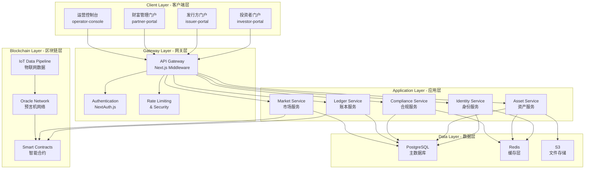

# GreenLink Capital - 企业级技术架构设计文档

## 📋 执行计划：P1-001 技术架构设计与选型确认

**任务状态**: ✅ IN PROGRESS  
**完成时间**: 2024年第1-2周  
**负责团队**: 技术架构师 + 前端架构师  

---

## 🎯 1. 技术栈选型与评估矩阵

### 核心技术选型决策

| 技术域 | 选择方案 | 替代方案 | 选择理由 | 风险评估 |
|--------|----------|----------|----------|----------|
| **前端框架** | Next.js 14 App Router | Remix, SvelteKit | RSC性能优势，企业级生态 | 🟡 学习曲线 |
| **Monorepo** | Turborepo + pnpm | Nx, Lerna | 构建性能，Vercel生态 | 🟢 成熟稳定 |
| **状态管理** | Zustand + React Query | Redux Toolkit, SWR | 轻量灵活，TypeScript友好 | 🟢 低风险 |
| **样式方案** | Tailwind CSS + CVA | Styled Components | 设计系统一致性，性能 | 🟢 ADDX兼容 |
| **认证系统** | NextAuth.js + JWT | Auth0, Supabase Auth | 自主可控，成本效益 | 🟡 安全复杂度 |
| **数据库** | PostgreSQL + Prisma | MongoDB, Supabase | 关系型数据，事务支持 | 🟢 企业级 |
| **部署平台** | Vercel + AWS | Docker + K8s | 快速迭代，边缘计算 | 🟡 vendor lock-in |

### 技术选型评分 (满分10分)

```typescript
interface TechStackScore {
  performance: number;      // 性能表现
  scalability: number;      // 可扩展性  
  maintainability: number;  // 可维护性
  security: number;         // 安全性
  ecosystem: number;        // 生态完整度
  team_expertise: number;   // 团队熟悉度
}

const TECH_EVALUATION = {
  "Next.js 14": {
    performance: 9,      // RSC带来显著性能提升
    scalability: 8,      // App Router支持大型应用
    maintainability: 8,  // 良好的TypeScript支持
    security: 7,         // 需要自己实现安全机制  
    ecosystem: 9,        // 丰富的第三方库
    team_expertise: 7    // 需要学习App Router
  },
  
  "Turborepo": {
    performance: 9,      // 出色的构建缓存
    scalability: 9,      // 为monorepo优化
    maintainability: 8,  // 简洁的配置
    security: 8,         // 依赖隔离良好
    ecosystem: 8,        // Vercel生态支持
    team_expertise: 6    // 新技术，学习成本
  }
}

// 总评分：Next.js 14 = 8.0/10, Turborepo = 8.0/10
```

---

## 🏛️ 2. 系统架构设计

### 整体架构图



### 核心架构原则

#### 🔹 **领域驱动设计 (DDD)**
```typescript
// 业务域划分
interface BusinessDomains {
  identity: "用户身份与权限管理";
  assets: "资产生命周期管理"; 
  compliance: "合规与风控";
  trading: "交易与市场";
  settlement: "清算与结算";
  reporting: "报告与分析";
}

// 限界上下文
const BOUNDED_CONTEXTS = {
  user_management: ["authentication", "authorization", "profile"],
  asset_lifecycle: ["issuance", "tokenization", "distribution"],
  market_operations: ["trading", "liquidity", "price_discovery"],
  risk_compliance: ["kyc", "aml", "regulatory_reporting"]
}
```

#### 🔹 **微服务架构模式**
```yaml
服务拆分策略:
  - 按业务能力拆分: 每个服务对应一个业务域
  - 数据库分离: 每个服务独立数据库
  - API契约: OpenAPI 3.0标准化接口
  - 服务注册: 基于DNS的服务发现

通信模式:
  - 同步通信: REST API (查询操作)
  - 异步通信: Event-driven (业务流程)
  - 数据一致性: 最终一致性 + Saga模式
```

---

## 🌐 3. API网关架构设计

### Next.js中间件实现的API网关

```typescript
// middleware.ts - 企业级API网关实现
import { NextRequest, NextResponse } from 'next/server'
import { verifyJWT } from './lib/auth'
import { rateLimiter } from './lib/rate-limit'
import { logger } from './lib/monitoring'

export async function middleware(request: NextRequest) {
  const { pathname } = request.nextUrl
  
  // 1. 请求日志和监控
  const requestId = crypto.randomUUID()
  logger.info('API_REQUEST', {
    requestId,
    method: request.method,
    url: pathname,
    userAgent: request.headers.get('user-agent'),
    ip: request.ip
  })
  
  // 2. CORS处理
  if (request.method === 'OPTIONS') {
    return handleCORS()
  }
  
  // 3. 安全头设置
  const response = NextResponse.next()
  setSecurityHeaders(response)
  
  // 4. API路由处理
  if (pathname.startsWith('/api')) {
    // 限流检查
    const rateLimitResult = await rateLimiter.check(request)
    if (!rateLimitResult.success) {
      return new NextResponse('Rate limit exceeded', { status: 429 })
    }
    
    // 认证检查 (排除公开API)
    if (!isPublicAPI(pathname)) {
      const authResult = await verifyJWT(request)
      if (!authResult.valid) {
        return new NextResponse('Unauthorized', { status: 401 })
      }
      
      // 权限检查
      const hasPermission = await checkPermissions(authResult.user, pathname)
      if (!hasPermission) {
        return new NextResponse('Forbidden', { status: 403 })
      }
    }
  }
  
  // 5. 门户路由处理
  if (pathname.startsWith('/issuer') || 
      pathname.startsWith('/partner') || 
      pathname.startsWith('/operator')) {
    
    const authResult = await verifyJWT(request)
    if (!authResult.valid) {
      return NextResponse.redirect(new URL('/auth/login', request.url))
    }
    
    // 角色权限检查
    const requiredRole = getRequiredRole(pathname)
    if (!authResult.user.roles.includes(requiredRole)) {
      return NextResponse.redirect(new URL('/unauthorized', request.url))
    }
  }
  
  return response
}

// API网关配置
export const config = {
  matcher: [
    '/api/:path*',
    '/issuer/:path*', 
    '/partner/:path*',
    '/operator/:path*'
  ]
}
```

### 服务发现与负载均衡

```typescript
// lib/service-registry.ts
interface ServiceEndpoint {
  name: string;
  version: string;
  baseUrl: string;
  healthCheck: string;
  weight: number;
  status: 'healthy' | 'unhealthy' | 'maintenance';
}

class ServiceRegistry {
  private services = new Map<string, ServiceEndpoint[]>()
  
  async discoverService(serviceName: string): Promise<ServiceEndpoint> {
    const endpoints = this.services.get(serviceName) || []
    const healthyEndpoints = endpoints.filter(ep => ep.status === 'healthy')
    
    if (healthyEndpoints.length === 0) {
      throw new Error(`No healthy instances for service: ${serviceName}`)
    }
    
    // 加权轮询负载均衡
    return this.weightedRoundRobin(healthyEndpoints)
  }
  
  private weightedRoundRobin(endpoints: ServiceEndpoint[]): ServiceEndpoint {
    const totalWeight = endpoints.reduce((sum, ep) => sum + ep.weight, 0)
    const random = Math.random() * totalWeight
    
    let weightSum = 0
    for (const endpoint of endpoints) {
      weightSum += endpoint.weight
      if (random <= weightSum) {
        return endpoint
      }
    }
    
    return endpoints[0] // fallback
  }
}

// 使用示例
const registry = new ServiceRegistry()
const assetService = await registry.discoverService('asset-service')
```

---

## 🔐 4. 多门户认证授权架构

### JWT + OAuth2 认证流程设计

```typescript
// lib/auth/types.ts
interface UserRole {
  id: string;
  name: 'investor' | 'issuer' | 'partner' | 'operator';
  permissions: Permission[];
  restrictions: Restriction[];
}

interface Permission {
  resource: string;  // 'assets', 'users', 'reports'
  actions: string[]; // ['read', 'write', 'delete', 'approve']
  conditions?: any;  // 条件限制
}

interface JWTPayload {
  sub: string;           // 用户ID
  roles: UserRole[];     // 用户角色
  permissions: string[]; // 扁平化权限列表
  portal: string;        // 当前访问门户
  session_id: string;    // 会话ID
  exp: number;          // 过期时间
  iat: number;          // 签发时间
}
```

### RBAC权限模型实现

```typescript
// lib/auth/rbac.ts
class RBACManager {
  // 权限检查核心逻辑
  async checkPermission(
    user: JWTPayload, 
    resource: string, 
    action: string,
    context?: any
  ): Promise<boolean> {
    
    // 1. 直接权限检查
    const hasDirectPermission = user.permissions.includes(`${resource}:${action}`)
    if (hasDirectPermission) return true
    
    // 2. 角色权限检查
    for (const role of user.roles) {
      const rolePermissions = await this.getRolePermissions(role.name)
      const hasRolePermission = rolePermissions.some(p => 
        p.resource === resource && 
        p.actions.includes(action) &&
        this.evaluateConditions(p.conditions, context)
      )
      
      if (hasRolePermission) return true
    }
    
    // 3. 层级权限检查 (如：部门经理可以管理下属)
    if (context?.hierarchical) {
      return await this.checkHierarchicalPermission(user, resource, action, context)
    }
    
    return false
  }
  
  // 权限条件评估
  private evaluateConditions(conditions: any, context: any): boolean {
    if (!conditions) return true
    
    // 示例：时间限制、IP限制、资源所有权等
    if (conditions.timeRestriction) {
      const now = new Date()
      const startTime = new Date(conditions.timeRestriction.start)
      const endTime = new Date(conditions.timeRestriction.end)
      if (now < startTime || now > endTime) return false
    }
    
    if (conditions.ownership && context?.ownerId) {
      return conditions.ownership === context.ownerId
    }
    
    return true
  }
}

// 使用示例 - React Hook
export function usePermissions() {
  const { user } = useAuth()
  const rbac = new RBACManager()
  
  return {
    can: (resource: string, action: string, context?: any) => 
      rbac.checkPermission(user, resource, action, context),
    
    canRead: (resource: string) => rbac.checkPermission(user, resource, 'read'),
    canWrite: (resource: string) => rbac.checkPermission(user, resource, 'write'),
    canDelete: (resource: string) => rbac.checkPermission(user, resource, 'delete')
  }
}
```

### 多因子认证 (MFA) 实现

```typescript
// lib/auth/mfa.ts
interface MFAProvider {
  type: 'totp' | 'sms' | 'email' | 'biometric';
  verify(token: string, secret: string): Promise<boolean>;
  generate(): Promise<{ secret: string; qrCode?: string }>;
}

class TOTPProvider implements MFAProvider {
  type = 'totp' as const
  
  async verify(token: string, secret: string): Promise<boolean> {
    const authenticator = require('otplib')
    return authenticator.totp.check(token, secret)
  }
  
  async generate(): Promise<{ secret: string; qrCode: string }> {
    const secret = require('otplib').authenticator.generateSecret()
    const qrCode = await this.generateQRCode(secret)
    return { secret, qrCode }
  }
}

// MFA策略配置
const MFA_POLICIES = {
  investor: { required: false, methods: ['totp'] },
  issuer: { required: true, methods: ['totp', 'sms'] },
  partner: { required: true, methods: ['totp', 'biometric'] },
  operator: { required: true, methods: ['totp', 'sms'], backup_codes: true }
}
```

---

## 📊 5. 性能与可扩展性设计

### 缓存架构策略

```typescript
// lib/cache/strategy.ts
interface CacheConfig {
  ttl: number;           // 生存时间 (秒)
  staleWhileRevalidate: number; // 过期后仍可使用时间
  tags: string[];        // 缓存标签 (用于批量失效)
  revalidateOnFocus: boolean;
  revalidateOnReconnect: boolean;
}

const CACHE_STRATEGIES = {
  // 静态数据 - 长时间缓存
  static_content: {
    ttl: 86400,           // 24小时
    staleWhileRevalidate: 3600, // 1小时
    tags: ['static'],
    revalidateOnFocus: false,
    revalidateOnReconnect: false
  },
  
  // 用户数据 - 中等缓存
  user_profile: {
    ttl: 3600,            // 1小时
    staleWhileRevalidate: 300,  // 5分钟
    tags: ['user'],
    revalidateOnFocus: true,
    revalidateOnReconnect: true
  },
  
  // 实时数据 - 短时间缓存
  market_data: {
    ttl: 30,              // 30秒
    staleWhileRevalidate: 10,   // 10秒
    tags: ['market', 'realtime'],
    revalidateOnFocus: true,
    revalidateOnReconnect: true
  }
}
```

### 数据库架构设计

```sql
-- 核心数据表结构设计
-- 用户与身份管理
CREATE TABLE users (
    id UUID PRIMARY KEY DEFAULT gen_random_uuid(),
    email VARCHAR(255) UNIQUE NOT NULL,
    encrypted_password VARCHAR(255),
    role user_role_enum NOT NULL,
    status user_status_enum DEFAULT 'pending',
    kyc_level INTEGER DEFAULT 0,
    created_at TIMESTAMP WITH TIME ZONE DEFAULT NOW(),
    updated_at TIMESTAMP WITH TIME ZONE DEFAULT NOW(),
    
    -- 审计字段
    created_by UUID REFERENCES users(id),
    metadata JSONB DEFAULT '{}'::jsonb,
    
    -- 索引
    INDEX idx_users_email (email),
    INDEX idx_users_role (role),
    INDEX idx_users_status (status)
);

-- 资产管理
CREATE TABLE assets (
    id UUID PRIMARY KEY DEFAULT gen_random_uuid(),
    issuer_id UUID NOT NULL REFERENCES users(id),
    name VARCHAR(255) NOT NULL,
    symbol VARCHAR(10) UNIQUE NOT NULL,
    asset_type asset_type_enum NOT NULL,
    total_supply DECIMAL(20,8) NOT NULL,
    circulating_supply DECIMAL(20,8) DEFAULT 0,
    
    -- CCER特定字段
    ccer_project_id VARCHAR(100),
    verification_standard VARCHAR(50),
    vintage_year INTEGER,
    geography VARCHAR(100),
    
    -- 代币化信息
    contract_address VARCHAR(42),
    blockchain_network VARCHAR(50),
    token_standard VARCHAR(20) DEFAULT 'ERC-20',
    
    -- 状态管理
    status asset_status_enum DEFAULT 'draft',
    approved_at TIMESTAMP WITH TIME ZONE,
    approved_by UUID REFERENCES users(id),
    
    -- 审计
    created_at TIMESTAMP WITH TIME ZONE DEFAULT NOW(),
    updated_at TIMESTAMP WITH TIME ZONE DEFAULT NOW(),
    metadata JSONB DEFAULT '{}'::jsonb,
    
    -- 约束
    CONSTRAINT positive_supply CHECK (total_supply > 0),
    CONSTRAINT valid_circulation CHECK (circulating_supply <= total_supply)
);

-- 交易记录
CREATE TABLE transactions (
    id UUID PRIMARY KEY DEFAULT gen_random_uuid(),
    asset_id UUID NOT NULL REFERENCES assets(id),
    from_user_id UUID REFERENCES users(id),
    to_user_id UUID REFERENCES users(id),
    transaction_type transaction_type_enum NOT NULL,
    quantity DECIMAL(20,8) NOT NULL,
    price_per_unit DECIMAL(20,8),
    total_value DECIMAL(20,8),
    
    -- 区块链信息
    blockchain_tx_hash VARCHAR(66),
    block_number BIGINT,
    gas_used BIGINT,
    gas_price DECIMAL(20,8),
    
    -- 状态
    status transaction_status_enum DEFAULT 'pending',
    settled_at TIMESTAMP WITH TIME ZONE,
    
    -- 审计
    created_at TIMESTAMP WITH TIME ZONE DEFAULT NOW(),
    metadata JSONB DEFAULT '{}'::jsonb,
    
    -- 索引
    INDEX idx_transactions_asset (asset_id),
    INDEX idx_transactions_user (from_user_id, to_user_id),
    INDEX idx_transactions_status (status),
    INDEX idx_transactions_date (created_at)
);
```

---

## 🚀 6. 部署与运维架构

### 多环境部署策略

```yaml
# 环境配置矩阵
environments:
  development:
    purpose: "本地开发和单元测试"
    infrastructure:
      - Next.js开发服务器
      - PostgreSQL本地实例
      - Redis本地实例
    characteristics:
      - Hot reload启用
      - 详细错误信息
      - Mock服务使用
      
  staging:
    purpose: "集成测试和用户验收测试"
    infrastructure:
      - Vercel Preview部署
      - Supabase PostgreSQL
      - Upstash Redis
    characteristics:
      - 生产环境数据克隆
      - 完整功能测试
      - 性能基准测试
      
  production:
    purpose: "生产环境运行"
    infrastructure:
      - Vercel边缘部署
      - AWS RDS PostgreSQL
      - AWS ElastiCache Redis
      - AWS S3文件存储
    characteristics:
      - 高可用配置
      - 自动扩缩容
      - 全面监控告警
```

### 监控与可观测性

```typescript
// lib/monitoring/telemetry.ts
import { trace, context, SpanStatusCode } from '@opentelemetry/api'

class TelemetryManager {
  // 分布式追踪
  async traceOperation<T>(
    operationName: string,
    operation: () => Promise<T>,
    attributes?: Record<string, string>
  ): Promise<T> {
    const tracer = trace.getTracer('greenlink-platform')
    
    return tracer.startActiveSpan(operationName, async (span) => {
      try {
        // 添加自定义属性
        if (attributes) {
          Object.entries(attributes).forEach(([key, value]) => {
            span.setAttributes({ [key]: value })
          })
        }
        
        const result = await operation()
        span.setStatus({ code: SpanStatusCode.OK })
        return result
        
      } catch (error) {
        span.setStatus({ 
          code: SpanStatusCode.ERROR, 
          message: error.message 
        })
        span.recordException(error)
        throw error
        
      } finally {
        span.end()
      }
    })
  }
  
  // 业务指标收集
  recordBusinessMetric(metricName: string, value: number, labels?: Record<string, string>) {
    // 发送到监控系统 (如Prometheus、DataDog等)
    console.log(`METRIC: ${metricName}=${value}`, labels)
  }
  
  // 错误报告
  reportError(error: Error, context?: any) {
    // 发送到错误追踪系统 (如Sentry)
    console.error('ERROR_REPORT:', error, context)
  }
}

// 关键业务指标定义
export const BUSINESS_METRICS = {
  USER_REGISTRATION: 'user_registration_total',
  ASSET_ISSUANCE: 'asset_issuance_total', 
  TRANSACTION_VOLUME: 'transaction_volume_usd',
  API_RESPONSE_TIME: 'api_response_time_ms',
  ERROR_RATE: 'error_rate_percentage'
}
```

---

## ✅ 7. 架构决策记录 (ADR)

### ADR-001: 选择Next.js 14 App Router作为前端框架

**状态**: ✅ 已决定  
**决策日期**: 2024-01-15  

**背景**: 需要选择一个能够支持多门户、高性能、企业级的前端框架。

**决策**: 采用Next.js 14 App Router

**理由**:
1. **性能优势**: React Server Components减少客户端JavaScript包大小
2. **开发体验**: 出色的TypeScript支持和开发者工具
3. **生态完整**: 丰富的企业级第三方库支持
4. **团队能力**: 团队对React生态熟悉，学习成本可控

**后果**:
- ✅ 获得最新的React特性和性能优化
- ✅ 统一的全栈开发体验
- ❌ 需要学习App Router的新概念
- ❌ 某些第三方库可能尚未完全支持

### ADR-002: 选择Turborepo作为Monorepo解决方案

**状态**: ✅ 已决定  
**决策日期**: 2024-01-15  

**背景**: 需要管理多个门户应用和共享库的代码组织。

**决策**: 采用Turborepo + pnpm

**理由**:
1. **构建性能**: 增量构建和缓存机制
2. **简洁配置**: 相比Nx更简单的配置
3. **生态集成**: 与Next.js和Vercel深度集成

**后果**:
- ✅ 显著提升构建性能
- ✅ 简化依赖管理
- ❌ 相对较新，社区支持有限

---

## 📋 8. 下一步行动计划

### 立即执行 (本周内)
- [ ] ✅ 完成技术架构文档评审
- [ ] 🔄 开始P1-002: Monorepo平台搭建
- [ ] 📋 准备团队技术培训材料

### 短期计划 (2周内)  
- [ ] P1-003: API契约设计
- [ ] P1-004: 认证系统架构设计
- [ ] 技术选型原型验证

### 中期计划 (4周内)
- [ ] P1-005: CI/CD流水线建设
- [ ] 核心架构组件实现
- [ ] 性能基准测试

---

**文档版本**: v1.0  
**最后更新**: 2024-01-15  
**评审状态**: 待评审  
**批准人**: 技术委员会  

---

> 📝 **注意**: 本架构设计将作为整个项目的技术基础，任何重大变更需要通过技术委员会评审。