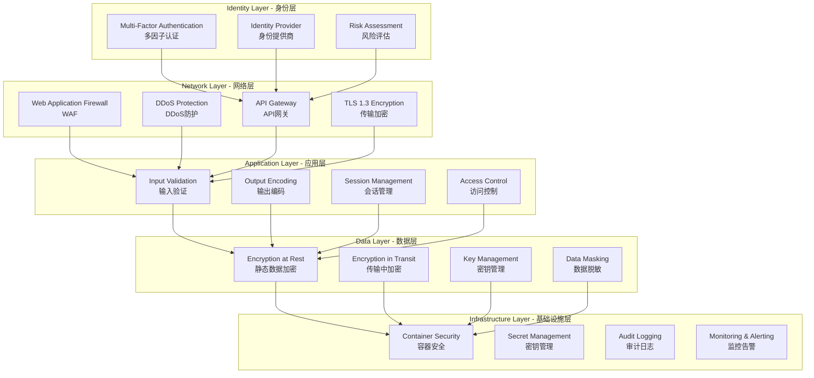

# 企业级安全架构设计

## 🔐 安全架构总览

### 零信任安全模型


## 🎯 威胁模型分析

### STRIDE威胁分类
```typescript
interface ThreatModel {
  category: 'Spoofing' | 'Tampering' | 'Repudiation' | 'Information Disclosure' | 'Denial of Service' | 'Elevation of Privilege';
  description: string;
  likelihood: 'Low' | 'Medium' | 'High';
  impact: 'Low' | 'Medium' | 'High';
  mitigation: string[];
}

const THREAT_ANALYSIS: ThreatModel[] = [
  {
    category: 'Spoofing',
    description: '攻击者冒充合法用户身份',
    likelihood: 'High',
    impact: 'High',
    mitigation: [
      '多因素认证 (MFA)',
      '设备指纹识别',
      '生物特征验证',
      '行为分析'
    ]
  },
  {
    category: 'Tampering',
    description: '恶意修改数据或代码',
    likelihood: 'Medium',
    impact: 'High',
    mitigation: [
      '数字签名验证',
      '完整性检查',
      '代码签名',
      '区块链不可篡改记录'
    ]
  },
  {
    category: 'Information Disclosure',
    description: '敏感信息泄露',
    likelihood: 'High',
    impact: 'High',
    mitigation: [
      '端到端加密',
      '数据分类标记',
      '访问控制矩阵',
      '数据丢失防护 (DLP)'
    ]
  }
]
```

### 攻击面分析
```yaml
External Attack Surface:
  - Web应用程序接口
  - API端点暴露
  - DNS和域名系统
  - 社会工程攻击
  
Internal Attack Surface:
  - 内部系统访问
  - 员工权限滥用
  - 供应链攻击
  - 物理访问控制

Digital Asset Specific:
  - 私钥管理风险
  - 智能合约漏洞
  - 预言机操控
  - 治理攻击
```

## 🔑 身份与访问管理 (IAM)

### 多因素认证架构
```typescript
// MFA策略配置
interface MFAConfig {
  required: boolean;
  methods: MFAMethod[];
  backupCodes: boolean;
  rememberDevice: number; // 天数
  gracePeriod: number;    // 分钟
}

enum MFAMethod {
  TOTP = 'totp',           // 时间动态密码
  SMS = 'sms',             // 短信验证
  BIOMETRIC = 'biometric', // 生物识别
  HARDWARE = 'hardware',   // 硬件密钥
  PUSH = 'push'            // 推送通知
}

const MFA_POLICIES: Record<UserRole, MFAConfig> = {
  investor: {
    required: false,
    methods: [MFAMethod.TOTP, MFAMethod.SMS],
    backupCodes: true,
    rememberDevice: 30,
    gracePeriod: 5
  },
  
  issuer: {
    required: true,
    methods: [MFAMethod.TOTP, MFAMethod.BIOMETRIC, MFAMethod.HARDWARE],
    backupCodes: true,
    rememberDevice: 7,
    gracePeriod: 0
  },
  
  partner: {
    required: true,
    methods: [MFAMethod.TOTP, MFAMethod.PUSH, MFAMethod.HARDWARE],
    backupCodes: true,
    rememberDevice: 7,
    gracePeriod: 0
  },
  
  operator: {
    required: true,
    methods: [MFAMethod.HARDWARE, MFAMethod.BIOMETRIC],
    backupCodes: false, // 不允许备用码
    rememberDevice: 0,  // 不记住设备
    gracePeriod: 0
  }
}
```

### 权限矩阵设计
```typescript
// 基于角色的访问控制 (RBAC)
interface Permission {
  resource: string;      // 资源类型
  actions: string[];     // 允许的操作
  constraints: any;      // 约束条件
  context: string[];     // 上下文要求
}

const PERMISSION_MATRIX: Record<UserRole, Permission[]> = {
  investor: [
    {
      resource: 'assets',
      actions: ['read', 'invest'],
      constraints: { status: 'approved' },
      context: ['own_portfolio']
    },
    {
      resource: 'transactions',
      actions: ['read'],
      constraints: { user_id: '$current_user' },
      context: ['own_transactions']
    }
  ],
  
  issuer: [
    {
      resource: 'assets',
      actions: ['create', 'read', 'update'],
      constraints: { issuer_id: '$current_user' },
      context: ['own_assets']
    },
    {
      resource: 'issuance',
      actions: ['create', 'read', 'update', 'submit'],
      constraints: { issuer_id: '$current_user' },
      context: ['own_issuance']
    }
  ],
  
  partner: [
    {
      resource: 'clients',
      actions: ['create', 'read', 'update'],
      constraints: { partner_id: '$current_user' },
      context: ['managed_clients']
    },
    {
      resource: 'orders',
      actions: ['create', 'read', 'update', 'execute'],
      constraints: { 
        client_id: '$managed_clients',
        amount: { max: 1000000 } // 单笔限额
      },
      context: ['client_trading']
    }
  ],
  
  operator: [
    {
      resource: '*',
      actions: ['*'],
      constraints: {},
      context: ['admin_operations', 'audit_trail']
    }
  ]
}
```

## 🛡️ 数据保护策略

### 数据分类标准
```typescript
enum DataClassification {
  PUBLIC = 'public',           // 公开数据
  INTERNAL = 'internal',       // 内部数据
  CONFIDENTIAL = 'confidential', // 机密数据
  RESTRICTED = 'restricted'    // 限制数据
}

interface DataPolicy {
  classification: DataClassification;
  encryption: {
    atRest: boolean;
    inTransit: boolean;
    algorithm: string;
  };
  access: {
    minRole: UserRole;
    mfaRequired: boolean;
    auditRequired: boolean;
  };
  retention: {
    period: number; // 天数
    archival: boolean;
    deletion: 'secure' | 'crypto';
  };
}

const DATA_POLICIES: Record<DataClassification, DataPolicy> = {
  [DataClassification.PUBLIC]: {
    classification: DataClassification.PUBLIC,
    encryption: {
      atRest: false,
      inTransit: true,
      algorithm: 'TLS 1.3'
    },
    access: {
      minRole: 'investor',
      mfaRequired: false,
      auditRequired: false
    },
    retention: {
      period: 365,
      archival: false,
      deletion: 'secure'
    }
  },
  
  [DataClassification.RESTRICTED]: {
    classification: DataClassification.RESTRICTED,
    encryption: {
      atRest: true,
      inTransit: true,
      algorithm: 'AES-256-GCM'
    },
    access: {
      minRole: 'operator',
      mfaRequired: true,
      auditRequired: true
    },
    retention: {
      period: 2555, // 7年合规要求
      archival: true,
      deletion: 'crypto' // 加密销毁
    }
  }
}
```

### 加密策略实现
```typescript
// 分层加密架构
class EncryptionManager {
  // 密钥层级
  private keyHierarchy = {
    masterKey: process.env.MASTER_KEY,     // 主密钥 (HSM保护)
    dataEncryptionKeys: new Map(),        // 数据加密密钥
    fieldEncryptionKeys: new Map()        // 字段级加密密钥
  }
  
  // 敏感字段加密
  async encryptField(data: string, fieldType: string): Promise<string> {
    const key = await this.getDerivedKey(fieldType)
    const iv = crypto.randomBytes(16)
    const cipher = crypto.createCipher('aes-256-gcm', key)
    
    cipher.setAAD(Buffer.from(fieldType)) // 关联数据认证
    
    let encrypted = cipher.update(data, 'utf8', 'base64')
    encrypted += cipher.final('base64')
    
    const authTag = cipher.getAuthTag()
    
    return JSON.stringify({
      data: encrypted,
      iv: iv.toString('base64'),
      authTag: authTag.toString('base64'),
      algorithm: 'aes-256-gcm'
    })
  }
  
  // 密钥轮换
  async rotateKeys(): Promise<void> {
    const newKeys = await this.generateNewKeys()
    
    // 重新加密现有数据
    await this.reencryptData(newKeys)
    
    // 更新密钥引用
    this.keyHierarchy = newKeys
    
    // 记录轮换事件
    await this.auditLog('KEY_ROTATION', { 
      timestamp: new Date(),
      keyCount: newKeys.dataEncryptionKeys.size
    })
  }
}
```

## 🔒 API安全防护

### Web应用防火墙 (WAF)
```typescript
// WAF规则配置
interface WAFRule {
  name: string;
  pattern: RegExp;
  action: 'block' | 'challenge' | 'log';
  severity: 'low' | 'medium' | 'high' | 'critical';
}

const WAF_RULES: WAFRule[] = [
  // SQL注入防护
  {
    name: 'SQL_INJECTION',
    pattern: /(\bUNION\b|\bSELECT\b|\bINSERT\b|\bDROP\b|\bDELETE\b).*(FROM|INTO|TABLE)/i,
    action: 'block',
    severity: 'critical'
  },
  
  // XSS防护
  {
    name: 'XSS_SCRIPT',
    pattern: /<script[^>]*>.*?<\/script>/gi,
    action: 'block',
    severity: 'high'
  },
  
  // 路径遍历防护
  {
    name: 'PATH_TRAVERSAL',
    pattern: /\.\.(\/|\\)/g,
    action: 'block',
    severity: 'high'
  },
  
  // 暴力破解防护
  {
    name: 'BRUTE_FORCE',
    pattern: /\/auth\/login/,
    action: 'challenge',
    severity: 'medium'
  }
]

// 限流规则
const RATE_LIMIT_RULES = {
  // 登录端点严格限制
  '/auth/login': {
    windowMs: 15 * 60 * 1000, // 15分钟
    maxAttempts: 5,
    blockDuration: 60 * 60 * 1000, // 1小时
    skipSuccessfulRequests: true
  },
  
  // API端点
  '/api/*': {
    windowMs: 60 * 1000, // 1分钟
    maxAttempts: 100,
    blockDuration: 5 * 60 * 1000, // 5分钟
    skipSuccessfulRequests: false
  },
  
  // 文件上传
  '/upload/*': {
    windowMs: 60 * 1000,
    maxAttempts: 10,
    blockDuration: 10 * 60 * 1000, // 10分钟
    skipSuccessfulRequests: true
  }
}
```

### 输入验证框架
```typescript
// 使用Zod进行严格的输入验证
import { z } from 'zod'

// 用户注册验证
const UserRegistrationSchema = z.object({
  email: z.string()
    .email('无效的邮箱格式')
    .max(255, '邮箱长度不能超过255字符')
    .refine(email => !email.includes('+'), '不允许使用+符号'),
    
  password: z.string()
    .min(12, '密码至少12个字符')
    .regex(/^(?=.*[a-z])(?=.*[A-Z])(?=.*\d)(?=.*[@$!%*?&])[A-Za-z\d@$!%*?&]/, 
           '密码必须包含大小写字母、数字和特殊字符'),
           
  phone: z.string()
    .regex(/^\+[1-9]\d{10,14}$/, '无效的国际电话号码格式'),
    
  role: z.enum(['investor', 'issuer', 'partner'])
    .refine(role => role !== 'operator', '不能直接注册为操作员')
})

// 资产创建验证
const AssetCreationSchema = z.object({
  name: z.string()
    .min(1, '资产名称不能为空')
    .max(255, '资产名称不能超过255字符')
    .regex(/^[a-zA-Z0-9\s\-_]+$/, '资产名称只能包含字母、数字、空格、连字符和下划线'),
    
  symbol: z.string()
    .min(2, '代币符号至少2个字符')
    .max(10, '代币符号不能超过10个字符')
    .regex(/^[A-Z0-9]+$/, '代币符号只能包含大写字母和数字'),
    
  totalSupply: z.number()
    .positive('总供应量必须大于0')
    .max(1e18, '总供应量不能超过10^18')
    .multipleOf(0.000001, '最小精度为6位小数'),
    
  ccerProjectId: z.string()
    .regex(/^CCER-[A-Z]{2}-\d{4}-\d{6}$/, '无效的CCER项目ID格式')
})

// 验证中间件
export function validateRequest<T>(schema: z.ZodSchema<T>) {
  return (req: Request, res: Response, next: NextFunction) => {
    try {
      const validatedData = schema.parse(req.body)
      req.body = validatedData // 使用验证后的数据
      next()
    } catch (error) {
      if (error instanceof z.ZodError) {
        return res.status(400).json({
          success: false,
          error: {
            code: 'VALIDATION_ERROR',
            message: '输入数据验证失败',
            details: error.errors
          }
        })
      }
      next(error)
    }
  }
}
```

## 🔍 安全监控与响应

### 安全事件监控
```typescript
interface SecurityEvent {
  id: string;
  timestamp: Date;
  type: SecurityEventType;
  severity: 'low' | 'medium' | 'high' | 'critical';
  source: string;
  details: any;
  userId?: string;
  ipAddress: string;
  userAgent: string;
}

enum SecurityEventType {
  // 认证事件
  LOGIN_SUCCESS = 'login_success',
  LOGIN_FAILURE = 'login_failure',
  LOGOUT = 'logout',
  MFA_CHALLENGE = 'mfa_challenge',
  PASSWORD_RESET = 'password_reset',
  
  // 授权事件
  ACCESS_GRANTED = 'access_granted',
  ACCESS_DENIED = 'access_denied',
  PRIVILEGE_ESCALATION = 'privilege_escalation',
  
  // 数据事件
  DATA_ACCESS = 'data_access',
  DATA_MODIFICATION = 'data_modification',
  DATA_EXPORT = 'data_export',
  
  // 系统事件
  CONFIGURATION_CHANGE = 'configuration_change',
  SYSTEM_ERROR = 'system_error',
  PERFORMANCE_ANOMALY = 'performance_anomaly'
}

class SecurityMonitor {
  private alertRules: AlertRule[] = [
    // 多次登录失败
    {
      condition: (events) => 
        events.filter(e => 
          e.type === SecurityEventType.LOGIN_FAILURE && 
          Date.now() - e.timestamp.getTime() < 5 * 60 * 1000
        ).length >= 5,
      action: 'BLOCK_IP',
      severity: 'high'
    },
    
    // 异常数据访问
    {
      condition: (events) =>
        events.filter(e =>
          e.type === SecurityEventType.DATA_ACCESS &&
          e.details.dataClassification === 'restricted'
        ).length >= 10,
      action: 'SECURITY_REVIEW',
      severity: 'medium'
    },
    
    // 权限提升尝试
    {
      condition: (events) =>
        events.some(e =>
          e.type === SecurityEventType.PRIVILEGE_ESCALATION
        ),
      action: 'IMMEDIATE_ALERT',
      severity: 'critical'
    }
  ]
  
  async processEvent(event: SecurityEvent): Promise<void> {
    // 记录事件
    await this.logEvent(event)
    
    // 检查告警规则
    const recentEvents = await this.getRecentEvents(event.userId, event.ipAddress)
    
    for (const rule of this.alertRules) {
      if (rule.condition([...recentEvents, event])) {
        await this.triggerAlert(rule, event)
      }
    }
    
    // 实时风险评分
    await this.updateRiskScore(event)
  }
  
  private async triggerAlert(rule: AlertRule, event: SecurityEvent): Promise<void> {
    const alert = {
      id: crypto.randomUUID(),
      timestamp: new Date(),
      rule: rule.name,
      severity: rule.severity,
      event: event,
      action: rule.action
    }
    
    // 发送告警通知
    await this.sendAlert(alert)
    
    // 执行自动响应
    await this.executeResponse(rule.action, event)
  }
}
```

### 事件响应流程
```yaml
安全事件响应流程:
  
  Level 1 - 自动响应:
    - IP地址封禁
    - 账户临时锁定  
    - 会话强制终止
    - 限流规则触发
    
  Level 2 - 人工介入:
    - 安全团队通知
    - 事件分析调查
    - 影响范围评估
    - 临时缓解措施
    
  Level 3 - 危机管理:
    - 高级管理层通知
    - 法务合规介入  
    - 外部专家协助
    - 公关危机应对
    
  Level 4 - 灾难恢复:
    - 系统完全隔离
    - 数据备份恢复
    - 业务连续性计划
    - 监管机构报告
```

## 📋 合规与审计

### 合规框架对照
```typescript
interface ComplianceRequirement {
  framework: string;
  requirement: string;
  controls: string[];
  evidence: string[];
  status: 'implemented' | 'in_progress' | 'planned';
}

const COMPLIANCE_MATRIX: ComplianceRequirement[] = [
  // ISO 27001 信息安全管理
  {
    framework: 'ISO 27001',
    requirement: 'A.9.1.1 访问控制策略',
    controls: [
      '基于角色的访问控制 (RBAC)',
      '最小权限原则',
      '职责分离原则'
    ],
    evidence: [
      '访问控制策略文档',
      '权限矩阵配置',
      '定期访问审查记录'
    ],
    status: 'implemented'
  },
  
  // SOC 2 Type II
  {
    framework: 'SOC 2',
    requirement: 'CC6.1 逻辑和物理访问控制',
    controls: [
      '多因素认证',
      '特权访问管理',
      '访问日志监控'
    ],
    evidence: [
      'MFA配置证据',
      '特权账户清单',
      '访问日志报告'
    ],
    status: 'implemented'
  },
  
  // GDPR 数据保护
  {
    framework: 'GDPR',
    requirement: '第32条 处理安全性',
    controls: [
      '数据加密',  
      '访问控制',
      '数据最小化'
    ],
    evidence: [
      '加密实施证明',
      '数据处理记录',
      '数据保护影响评估'
    ],
    status: 'implemented'
  }
]
```

### 审计日志设计
```typescript
interface AuditLog {
  id: string;
  timestamp: Date;
  userId: string;
  sessionId: string;
  action: string;
  resource: string;
  outcome: 'success' | 'failure';
  details: {
    ipAddress: string;
    userAgent: string;
    location?: string;
    requestId: string;
    changes?: any; // 数据变更记录
  };
  metadata: {
    system: string;
    version: string;
    environment: string;
  };
}

class AuditLogger {
  async logAction(
    userId: string,
    action: string,
    resource: string,
    outcome: 'success' | 'failure',
    details: any
  ): Promise<void> {
    const auditEntry: AuditLog = {
      id: crypto.randomUUID(),
      timestamp: new Date(),
      userId,
      sessionId: this.getCurrentSessionId(),
      action,
      resource,
      outcome,
      details: {
        ...details,
        requestId: this.getCurrentRequestId()
      },
      metadata: {
        system: 'greenlink-platform',
        version: process.env.APP_VERSION,
        environment: process.env.NODE_ENV
      }
    }
    
    // 写入审计数据库（不可变存储）
    await this.writeToAuditDB(auditEntry)
    
    // 实时流式处理
    await this.streamToSIEM(auditEntry)
    
    // 关键操作额外保护
    if (this.isCriticalAction(action)) {
      await this.writeToBlockchain(auditEntry)
    }
  }
  
  // 生成合规报告
  async generateComplianceReport(
    startDate: Date,
    endDate: Date,
    framework: string
  ): Promise<ComplianceReport> {
    const auditEntries = await this.queryAuditLogs(startDate, endDate)
    
    return {
      period: { start: startDate, end: endDate },
      framework,
      totalEvents: auditEntries.length,
      criticalEvents: auditEntries.filter(e => this.isCriticalAction(e.action)).length,
      failureRate: auditEntries.filter(e => e.outcome === 'failure').length / auditEntries.length,
      complianceScore: this.calculateComplianceScore(auditEntries),
      recommendations: this.generateRecommendations(auditEntries)
    }
  }
}
```

## 🔧 安全开发生命周期 (SDLC)

### 安全检查清单
```yaml
Design Phase - 设计阶段:
  - [ ] 威胁建模完成
  - [ ] 安全需求定义
  - [ ] 架构安全评审
  - [ ] 数据流图绘制
  - [ ] 风险评估报告

Development Phase - 开发阶段:
  - [ ] 安全编码标准
  - [ ] 静态代码分析 (SAST)
  - [ ] 依赖安全扫描
  - [ ] 代码评审检查
  - [ ] 单元测试覆盖

Testing Phase - 测试阶段:
  - [ ] 动态应用扫描 (DAST)
  - [ ] 渗透测试
  - [ ] 安全回归测试
  - [ ] 负载测试
  - [ ] 社会工程测试

Deployment Phase - 部署阶段:
  - [ ] 生产环境加固
  - [ ] 安全配置验证
  - [ ] 监控告警设置
  - [ ] 事件响应计划
  - [ ] 备份恢复测试

Maintenance Phase - 维护阶段:
  - [ ] 安全补丁管理
  - [ ] 漏洞扫描
  - [ ] 访问权限审查
  - [ ] 安全培训
  - [ ] 合规审计
```

---

**文档版本**: v1.0  
**最后更新**: 2024-01-15  
**负责团队**: 安全架构团队  
**评审周期**: 季度评审